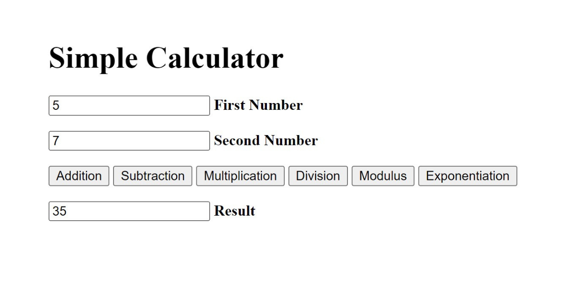

# Simple Calculator using PHP Programming Language
This is a project of the Server-Side Internet Programming course. In this project, I created a Simple Calculator using the PHP programming language. The user needs to input the first and second numbers that will be calculated and there are several operators that can be chosen such as addition, subtraction, multiplication, division, modulus, and exponentiation and at the end, there will be a result that directly shown after the user choose the operators, but to access this calculator is still using localhost.

